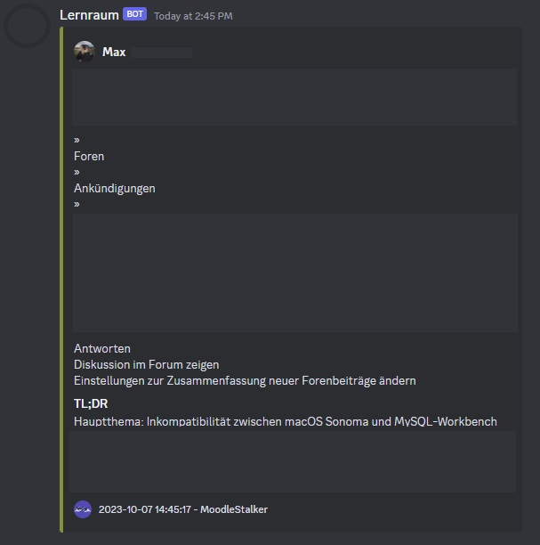

<h1 align="center">Moodle Mate</h1>
<p align="center">
    <strong>Automated Moodle Notification Management</strong>
</p>

---

## Contents
1. [Overview](#overview)
2. [Dependencies](#dependencies)
3. [Installation](#installation)
4. [Configuration](#configuration)
5. [Usage](#usage)
6. [Classes](#classes)
7. [Screenshots](#screenshots)
8. [Author](#author)

---

## <div id="overview">Overview</div>

Moodle Mate is a robust Python application crafted to automate the process of fetching Moodle notifications at regular intervals. Utilizing the GPT-3 API, it summarizes these notifications and forwards them via Pushbullet to your smartphone and Discord through a webhook.

---

## <div id="dependencies">Dependencies</div>

The software relies on the following custom API wrappers and libraries:

- **MoodleAPI**: For Moodle integration
- **OpenAI**: For text summarization
- **Pushbullet**: For mobile notifications
- **Discord**: For Discord webhook support

---

## <div id="installation">Installation</div>

Clone the repository and install the Python packages:

```bash
git clone https://github.com/EvickaStudio/Moodle-Mate.git
cd Moodle-Mate
pip install -r requirements.txt
```

---

## <div id="configuration">Configuration</div>

A configuration file, `config.ini`, is necessary for the application's operation. It should contain:

- Moodle URL
- Moodle Username & Password
- OpenAI API Key
- Pushbullet API Key
- Pushbullet State (1: Activated, 0: Deactivated)
- Webhook State (1: Activated, 0: Deactivated)
- Discord Webhook URL
- System Message for GPT-3 (Default in German)

Example:

```ini
[moodle]
; Moodle URL for API access
moodleUrl = https://subdomain.example.com/
; Username and password for Moodle login
username = 123456
password = password
; API key for OpenAI and Pushbullet
openaikey = sk-xxxxx
pushbulletkey = o.xxxxx
; Activate or deactivate Pushbullet and Discord
pushbulletState = 0 ; 1: Activated, 0: Deactivated
webhookState = 1
; Discord webhook URL
webhookUrl = https://discord.com/api/webhooks/xxxxx/xxxxx
; System message for GPT-3 summarization
systemMessage = "YOUR SYSTEM PROMPT HERE, EXAMPLE IN config_example.ini"
```

---

## <div id="usage">Usage</div>

Execute the script as follows:

```bash
python main.py
```

---

## <div id="classes">Classes</div>

### `MoodleNotificationHandler`

**Responsibility**: Manages Moodle notifications for specific users.

#### Methods

- `fetch_latest_notification()`: Retrieves latest notification.
- `fetch_newest_notification()`: Retrieves newest unread notification.
- `user_id_from()`: Fetches user data based on ID.

### `NotificationSummarizer`

**Responsibility**: Text summarization via OpenAI API.

#### Methods

- `summarize()`: Summarizes input text.

### `NotificationSender`

**Responsibility**: Dispatches notifications to designated platforms.

#### Methods

- `send()`: Forwards notifications to Pushbullet and Discord.

---

## <div id="screenshots">Screenshots</div>



---

## <div id="author">Author</div>

Developed with 💻 and ❤️ by [EvickaStudio](https://github.com/EvickaStudio).

---