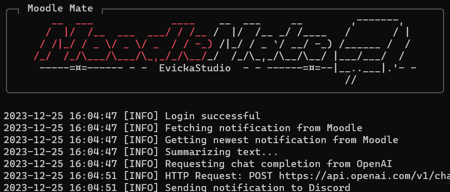
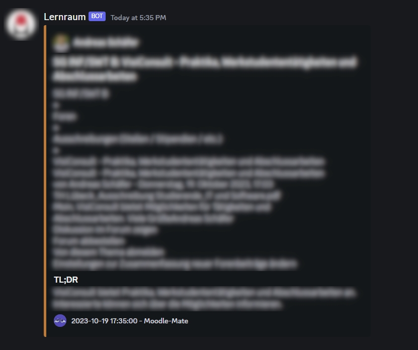

<!--
 Copyright 2024 EvickaStudio

 Licensed under the Apache License, Version 2.0 (the "License");
 you may not use this file except in compliance with the License.
 You may obtain a copy of the License at

     http://www.apache.org/licenses/LICENSE-2.0

 Unless required by applicable law or agreed to in writing, software
 distributed under the License is distributed on an "AS IS" BASIS,
 WITHOUT WARRANTIES OR CONDITIONS OF ANY KIND, either express or implied.
 See the License for the specific language governing permissions and
 limitations under the License.
-->

<div align="center">
  
  <h1>Moodle Mate</h1>
  <p><strong>Automated Moodle Notification Summarization</strong></p>
</div>

---

<p align="center">
  <a href="https://github.com/EvickaStudio/Moodle-Mate/actions"></a>
  <a href="https://github.com/EvickaStudio/Moodle-Mate/blob/main/LICENSE.md"></a>
  <a href="https://github.com/EvickaStudio/Moodle-Mate/issues"></a>
  <a href="https://github.com/EvickaStudio/Moodle-Mate/pulls"></a>
  
  <a href="https://github.com/EvickaStudio/Moodle-Mate/watchers"></a>
  

> [!NOTE]
> I am currently working on refactoring the codebase to improve its modularity and ease of maintenance. The current codebase is a mess and I'm sorry for that.
> In the meantime, you can find the latest version of the code in the `dev` branch.

---

## Table of Contents

---

1. [Overview](#overview)
2. [Dependencies](#dependencies)
3. [Installation](#installation)
4. [Configuration](#configuration)
5. [Usage](#usage)
6. [Documentation](#documentation)
7. [Screenshots](#screenshots)
8. [Contributing](#contributing)
9. [Author](#author)
10. [License](#license)

## <div id="overview">Overview</div>

---

Moodle Mate is an automated notification summarization tool for Moodle, which retrieves notifications from your Moodle account, summarizes their content using powerful AI models like GPT-3 or GPT-4 (optional), and delivers the exctracted information directly to you through channels such as Pushbullet and Discord. Designed for seamless integration into server environments, Moodle Mate offers high flexibility with adjustable update intervals tailored to meet your needs.

**Key Features:**

- Cost-efficient operations utilizing GPT-3.5-turbo (typically less than $0.15 per month, excluding server expenses). Alternatively you could just disable summarization in the config file
- Optional support for OpenAI Assistant, providing intelligent responses based on conversation history (currently available only in German). To use the Assistant, set the `test` variable in `summarizer.summarize` to `True`:

  Example:

  ```python
  # utils > main_loop.py > main_loop()

  # line 56, works [08.01.2024]
  summary = summarizer.summarize(text, True)
  ```

- Integration with popular platforms including Pushbullet, Discord, and email services
- Flexible scheduling options allowing periodic background execution with error handling

**NEW**: implementation of fakeopen a free api for openai chat completion using gpt-4-32k. (not recommendet, as many chat completion requests are failing)

## <div id="dependencies">Dependencies</div>

---

The software relies on the following custom API wrappers and libraries:

- **MoodleAPI**: Interface for the Moodle API
- **OpenAI**: Interface for the OpenAI API
- **Pushbullet**: Interface for the Pushbullet API
- **Discord**: Utilizes webhooks for Discord integration.

To ensure smooth operation of Moodle Mate, please check if python 3.10 or higher is installed.

- **Python >= 3.10:** Ensure you have installed Python version 3.10 or higher.

## <div id="installation">Installation</div>

---

Follow these steps to get started with Moodle Mate:

1. Clone the Git repository and navigate to the root directory:
   ```bash
   git clone https://github.com/EvickaStudio/Moodle-Mate.git
   cd Moodle-Mate
   ```
2. Install Python dependencies listed within the _requirements.txt_ file:
   ```bash
   pip install -r requirements.txt
   ```

## <div id="configuration">Configuration</div>

---

A configuration file, `config.ini`, is necessary for the application's operation. It should contain:

| Parameter       | Description                               | Required | Default            |
| --------------- | ----------------------------------------- | -------- | ------------------ |
| moodleUrl       | Moodle URL for API access                 | Yes      | N/A                |
| username        | Moodle Account Username                   | Yes      | N/A                |
| password        | Moodle Account Password                   | Yes      | N/A                |
| openaikey       | OpenAI API Key                            | No       | N/A                |
| pushbulletkey   | Pushbullet API Key                        | No       | N/A                |
| pushbulletState | Pushbullet State (ON = 1 else 0)          | No       | 0                  |
| webhookState    | Webhook State (ON = 1 else 0)             | No       | 0                  |
| webhookUrl      | Discord Webhook URL                       | Yes      | N/A                |
| systemMessage   | System Message for GPTs                   | Yes      | default config     |
| model           | GPT Model (recommend: gpt-4-1106-preview) | No       | gpt-3.5-turbo-1106 |
| fakeopen        | Implementation of fakeopen API            | Yes      | 0                  |
| summary         | Use GPT for summary (ON = 1 else 0)       | Yes      | 0                  |

Example can be found [here](examples/example_config.ini).

## <div id="usage">Usage</div>

---

Once all prerequisites are met and the configuration file prepared, simply execute the main script:

```bash
python3 main.py
```

## <div id="Documentation">Documentation</div>

---

Detailed documentation covering various aspects of Moodle Mate is organized by module and located within each corresponding directory. Explore the contents to gain insights about individual functionalities and usage patterns.

## <div id="screenshots">Screenshots</div>

---

- Main Program
  

- Discord Webhook
  

## <div id="Contributing">Contributing</div>

---

Your contributions are highly appreciated! Don't hesitate to report bugs, request new features, or ask questions by submitting an issue or PR.

## <div id="author">Author</div>

---

Made with ❤️ by [EvickaStudio](https://github.com/EvickaStudio). Reach out if you encounter any challenges or need assistance.

## <div id="license">License</div>

---

This project adheres to the terms of the Apache License 2.0 – see the [LICENSE.md](LICENSE.md) file for detailed information regarding licensing conditions and restrictions.
