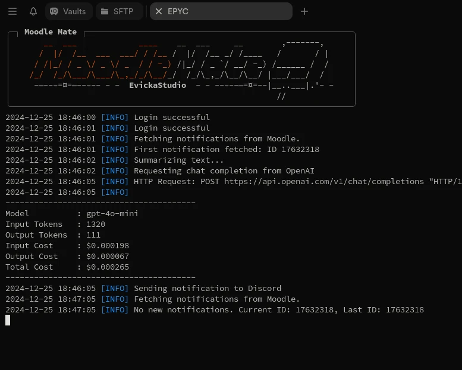

<div align="center">
  
  <h1>Moodle Mate</h1>
  <p><strong>Your Smart Moodle Notification Assistant</strong></p>
</div>

---

<p align="center">
  <a href="https://github.com/EvickaStudio/Moodle-Mate/actions"></a>
  <a href="https://github.com/EvickaStudio/Moodle-Mate/blob/main/LICENSE.md"></a>
  <a href="https://github.com/EvickaStudio/Moodle-Mate/issues"></a>
  <a href="https://github.com/EvickaStudio/Moodle-Mate/pulls"></a>
  
  <a href="https://github.com/EvickaStudio/Moodle-Mate/watchers"></a>
  
  

> [!NOTE]
> The codebase is currently under refinement for enhanced modularity and maintainability. For the latest version, please visit the [`dev`](https://github.com/EvickaStudio/Moodle-Mate/tree/dev) branch.

---

## Table of Contents

- [Table of Contents](#table-of-contents)
- [Overview](#overview)
- [Features](#features)
- [Dependencies](#dependencies)
- [Installation](#installation)
- [Configuration](#configuration)
- [Usage](#usage)
- [Documentation](#documentation)
  - [HTML to Markdown Conversion](#html-to-markdown-conversion)
- [Screenshots](#screenshots)
  - [Main Program Interface](#main-program-interface)
  - [Discord Webhook Integration](#discord-webhook-integration)
- [Contributing](#contributing)
- [Status](#status)
- [Author](#author)
- [License](#license)

---

## Overview

Moodle Mate automatically retrieves your Moodle notifications and intelligently summarizes them, giving you a quick and clear overview of what's important. It delivers these summaries straight to your preferred channels like Discord, Pushbullet, and more. Designed for seamless integration into server environments, Moodle Mate offers high flexibility with adjustable update intervals tailored to meet your needs.

## Features

- **Cost-effective Operation**: Utilizes GPT-3.5-turbo or GPT-4o-mini to minimize expenses (typically less than $0.10 per month, excluding server expenses). Alternatively, you can disable summarization in the config file.

- **Multi-Platform Support**: Supports popular platforms including **Discord**, **NTFY (BETA)**, Pushbullet for versatile notification delivery.
- **Flexible Scheduling**: Offers adjustable update intervals for periodic background execution.
- **Efficient Resource Usage**: Uses only ~50MB of RAM 99% of the time, making it lightweight and cost-effective (tested on a Raspberry Pi Zero 2 W).

**New Features:**

- **OpenAI API Endpoint Customization**: Allows the use of OpenAI-compatible REST API endpoints from other providers, local instances, or other models.

> **Note**: Cost calculations with current prices as of 30/09/24 can be seen in the logs for some models.

```bash
...
2024-09-30 15:28:40 [INFO] Summarizing text...
2024-09-30 15:28:40 [INFO] Requesting chat completion from OpenAI
2024-09-30 15:28:43 [INFO] HTTP Request: POST https://api.openai.com/v1/chat/completions "HTTP/1.1 200 OK"
2024-09-30 15:28:43 [INFO]
----------------------------------------
Model          : gpt-4o-mini
Input Tokens   : 1323  # Notification converted into tokens
Output Tokens  : 115
Input Cost     : $0.000198
Output Cost    : $0.000069
Total Cost     : $0.000267
----------------------------------------
2024-09-30 15:28:43 [INFO] Sending notification to Discord
...
```

## Dependencies

Moodle Mate depends on several specialized API wrappers and libraries:

- **MoodleAPI**: A custom interface for Moodle API interactions.
- **OpenAI**: Integration with OpenAI's API.
- **Pushbullet**: Connectivity with Pushbullet API.
- **NTFY**: Connectivity with NTFY API.
- **Discord**: Implementation using Discord webhooks.

Ensure Python 3.10 or higher is installed for compatibility and functionality.

## Installation

To install Moodle Mate, follow these steps:

1. **Clone the Repository**:

   ```bash
   git clone https://github.com/EvickaStudio/Moodle-Mate.git
   cd Moodle-Mate
   ```

2. **Install Python Dependencies**:

   ```bash
   pip install -r requirements.txt
   ```

<!-- 3. **Install Turndown Package** (for HTML to Markdown conversion):

   ```bash
   npm install turndown
   ``` -->

> **Optional**: If you prefer to work within a virtual environment, please follow the instructions provided in the [Optional Virtual Environment Setup](docs/ENV.md) guide. This helps avoid potential conflicts with other Python projects and ensures a clean installation.

## Configuration

Configuration of Moodle Mate requires setting up a `config.ini` file. Key parameters include Moodle URL, account credentials, and various API keys for functionality and integrations.

Just copy the example configuration file and fill in the required fields:

```bash
cp example/example_config.ini config.ini
```

| Parameter            | Description                                                                 | Required | Default                                       |
|----------------------|-----------------------------------------------------------------------------|----------|-----------------------------------------------|
| `MOODLE_URL`         | Full URL for Moodle instance (must include `https://`, e.g. `https://moodle.myschool.edu/`)  | Yes      | N/A                                           |
| `MOODLE_USERNAME`    | Username for Moodle login                                                     | Yes      | N/A                                           |
| `MOODLE_PASSWORD`    | Password for Moodle login                                                     | Yes      | N/A                                           |
| `SUMMARIZE`          | Enable or disable summarization (1 = enabled, 0 = disabled)                 | Yes      | `1`                                           |
| `OPENAI_API_ENDPOINT`| OpenAI API endpoint (e.g., <https://api.openai.com/v1/chat/completions>)  or OpenAI compatible API endpoint      | No       | `https://api.openai.com/v1/chat/completions` |
| `OPENAI_API_KEY`     | (OpenAI) API key                                                                | No       | N/A                                           |
| `MODEL`              | Model to use for summarization (e.g., gpt-3.5-turbo, gpt-4)                  | No       | `gpt-4o-mini`                                 |
| `SYSTEM_PROMPT`      | System prompt for AI summarization                                            | Yes      | Default configuration                         |
| `MAX_RETRIES`        | Maximum number of retries to fetch new messages before giving up             | No       | `5`                                           |
| `FETCH_INTERVAL`     | Interval in seconds to fetch new messages from Moodle                         | No       | `60`                                          |
| `ENABLED`            | Enable or disable Pushbullet notifications (1 = enabled, 0 = disabled)       | No       | `0`                                           |
| `PUSHBULLET_API_KEY` | Pushbullet API key                                                            | No       | N/A                                           |
| `ENABLED`            | Enable or disable Discord notifications (1 = enabled, 0 = disabled)          | No       | `1`                                           |
| `WEBHOOK_URL`        | Discord webhook URL                                                           | Yes      | N/A                                           |
| `BOT_NAME`           | Name of the bot as displayed in Discord                                      | No       | `Moodle Mate`                                  |
| `THUMBNAIL_URL`      | Thumbnail URL for Discord messages (e.g., favicon URL)                        | No       | `https://subdomain.example.com/favicon.ico`  |

A detailed example configuration is available in the [example configuration file](example/example_config.ini).

## Usage

With the configuration complete, execute the main script to start the application:

> [!TIP]
> Moodle Mate processes only new notifications, current last notification will not be send.

```bash
python3 main.py
```

## Documentation

Comprehensive documentation, detailing functionalities and operational guidelines, is organized by module within each directory. (Coming soon!)

### HTML to Markdown Conversion

Moodle Mate used Turndown, a JavaScript library, to convert HTML content to Markdown as other Python libraries did not perform as good as Turndown. But to remove further dependencies, I've tried to port the Turndown library to Python. The ported version is available in the [`turndown`](src/turndown/) directory. The ported version is not fully functional and may not work as expected. The original Turndown library can be found [here](https://github.com/mixmark-io/turndown/tree/master).

## Screenshots

### Main Program Interface

<div align="center">
  
</div>

### Discord Webhook Integration

<div align="center">
  
</div>

## Contributing

We welcome contributions to make Moodle Mate even better! You can contribute by:

- Reporting bugs
- Suggesting new features
- Submitting pull requests

## Status


## Author

Moodle Mate is created with ❤️ by [EvickaStudio](https://github.com/EvickaStudio).

## License

This project is licensed under the **Apache License 2.0** - see the [LICENSE.md](LICENSE.md) file for details.
