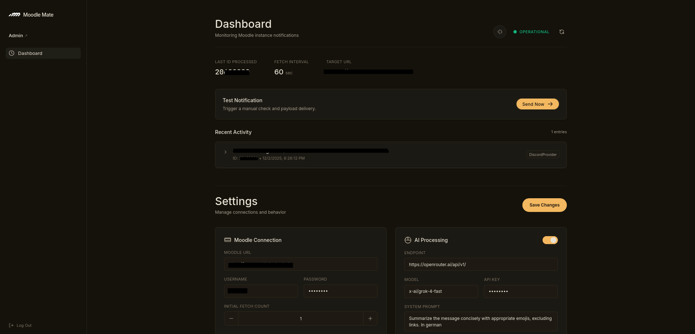
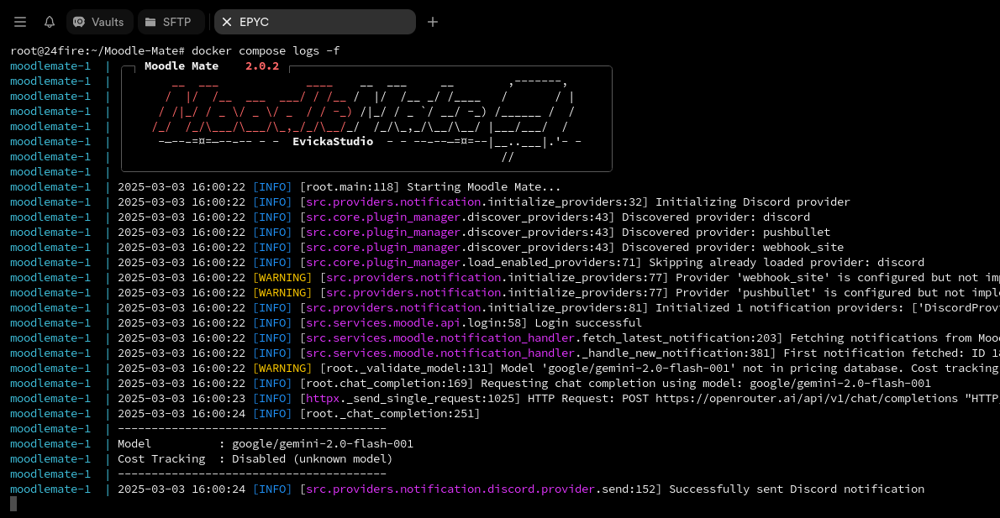
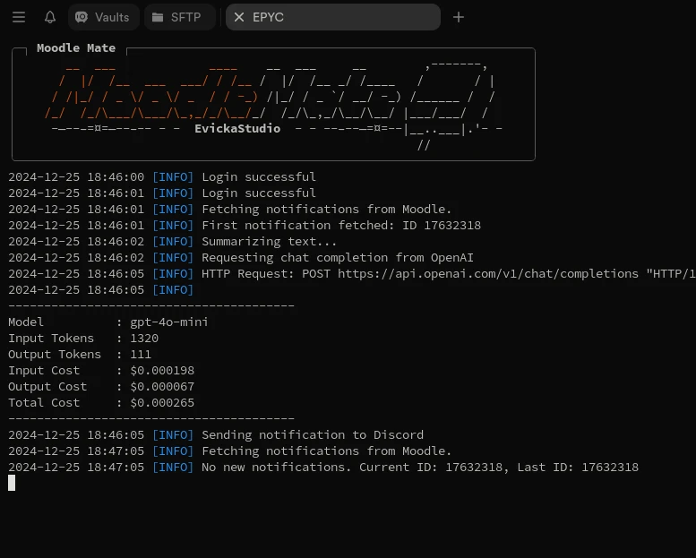
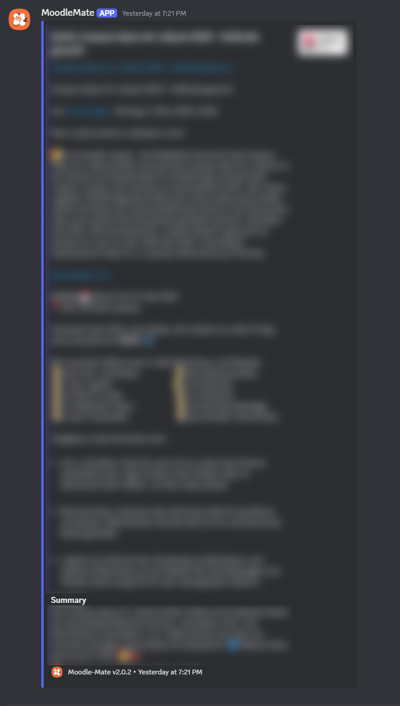

# Moodle Mate

<div align="center">
  
  <h1>Moodle Mate</h1>
  <p><strong>Your Smart Moodle Notification Assistant</strong></p>
</div>

<p align="center">
  <a href="https://github.com/EvickaStudio/Moodle-Mate/actions"></a>
  <a href="https://github.com/EvickaStudio/Moodle-Mate/blob/main/LICENSE.md"></a>
  <a href="https://github.com/EvickaStudio/Moodle-Mate/commits"></a>
  <a href="https://github.com/EvickaStudio/Moodle-Mate/issues"></a>
  <a href="https://github.com/EvickaStudio/Moodle-Mate/pulls"></a>
  
  <a href="https://deepwiki.com/EvickaStudio/Moodle-Mate"></a>
</p>

## What is Moodle Mate?

Moodle Mate is an Python application that fetches notifications from a Moodle instance (eg. a school or university) and delivers them to a notification platform (eg. Discord). This will allow you to stay up to date with all your courses and activities without having to manually check your E-Mail or Moodle.

Moodle Mate comes with an optional AI-powered summarization feature that will summarize the notifications for you and add it as an small TLDR to the notification. BYOK - Bring your own key, you can use any AI provider you want that supports the openai api structure, so if you have privacy concerns you can use an local hosted model (e.g. with [Ollama](https://ollama.ai/)).

## Key Features

- **Smart Notification Management**
  - Automatically fetch and process notifications from Moodle.
  - Optional AI-based content summarization that creates quick TLDRs.
  - Converts HTML notifications to Markdown for improved readability using [turndown-python](https://github.com/EvickaStudio/turndown-python).

- **Web Dashboard**
  - Monitor system status, logs, and configuration.
  - Live configuration editing.
  - Test notifications.
  - Protected by optional authentication.

- **Multi-Platform Support**
  - Discord (via webhooks)
  - Pushbullet (send to all your devices)
  - Plugin system for custom notification providers
  - Modular architecture for easy integration of new platforms

- **AI Integration**
  - Support for multiple AI providers (OpenAI API like)
  - Configurable models and parameters
  - Optional summarization feature

## Requirements

- Python 3.11 or higher
- Internet connection
- Moodle instance with REST API access enabled

## Installation

### Option 1: Standard Installation

1. **Clone the Repository**

   ```bash
   git clone https://github.com/EvickaStudio/Moodle-Mate.git
   cd Moodle-Mate
   ```

2. **Install Dependencies**

   Recommended (uv):

   ```bash
   uv sync --extra dev
   ```

   Optional (Make shortcuts):

   ```bash
   make install-dev
   make run
   make test
   make help
   ```

   If you prefer a virtualenv:

   ```bash
   python -m venv venv
   source venv/bin/activate
   # source venv/bin/activate.fish for fish shell
   pip install -r requirements.txt
   ```

3. **Configure the Application**

   Create a `.env` file in the root directory. You can copy the example:

   ```bash
   cp example.env .env
   ```

   Edit `.env` with your settings. Configuration uses environment variables with the `MOODLEMATE_` prefix.

   Example `.env`:

   ```env
   MOODLEMATE_MOODLE__URL=https://moodle.example.com
   MOODLEMATE_MOODLE__USERNAME=your_username
   MOODLEMATE_MOODLE__PASSWORD=your_password

   # Web UI Protection
   MOODLEMATE_WEB__AUTH_SECRET=your_secure_password

   MOODLEMATE_DISCORD__ENABLED=true
   MOODLEMATE_DISCORD__WEBHOOK_URL=https://discord.com/api/webhooks/...
   ```

### Option 2: Docker Installation

1. **Clone the Repository**

   ```bash
   git clone https://github.com/EvickaStudio/Moodle-Mate.git
   cd Moodle-Mate
   ```

2. **Configuration**

   Create and edit your `.env` file:

   ```bash
   cp example.env .env
   # Edit .env with your settings
   ```

3. **Build and Run with Docker**

   ```bash
   # Build the Docker image
   docker compose build

   # Run the container
   docker compose up -d
   ```

4. **View Logs**

   ```bash
   docker compose logs -f
   ```

## Usage

### Standard Usage

To start Moodle Mate, run:

```bash
uv run moodlemate
```

### Docker Usage

When using Docker, the application starts automatically when you run:

```bash
docker compose up -d
```

To stop the application:

```bash
docker compose down
```

When running, the application will:

1. Validate your configuration.
2. Start the Web Dashboard (default: <http://localhost:9095>).
3. Connect to your Moodle instance.
4. Continuously monitor for new notifications.
5. Process and deliver notifications according to your settings.

## Web Dashboard

Moodle Mate includes a built-in web dashboard for monitoring and configuration.

- **URL**: `http://127.0.0.1:9095` (default)
- **Features**:
  - View current status and metrics.
  - Trigger test notifications.
  - Edit non-sensitive configuration live (Web UI auth required).

**Security**: `MOODLEMATE_WEB__AUTH_SECRET` is required when Web UI is enabled. The dashboard always requires login and sets secure session/CSRF cookies.

## Screenshots

*Colors between the screenshots are different because of different themes in Termius.*

> Versions are messed up a bit, im sorry

### v2.0.3 (Web UI)



### v2.0.2 (Docker)



Running as Docker daemon, to see the logs run `docker compose logs -f`

### v2.0.1



Running as standard python application, you will automatically see the logs in the terminal you ran the command in. For KVMs running MoodleMate in the background, docker is the recommended way to run it, but you can also use tmux, screen or tmuxinator to run it in the background.

## Documentation

See the Diataxis-based docs index at `docs/README.md`.

### Discord notification



## Creating Custom Notification Providers

MoodleMate now supports a plugin system that allows you to easily create and add your own notification providers without modifying the core code.

### Quick Start

1. Start from the template at `src/moodlemate/templates/notification_service_template.py`.
2. Copy it to `src/moodlemate/providers/notification/your_service_name/provider.py` and rename the class (e.g., `YourServiceNameProvider`).
3. Implement `send(self, subject, message, summary=None) -> bool` with your service’s API.
4. Add configuration to your `.env` file:

   ```env
   MOODLEMATE_YOUR_SERVICE_NAME__ENABLED=true
   MOODLEMATE_YOUR_SERVICE_NAME__API_KEY=your_key
   ```

5. Optionally verify with `uv run moodlemate --test-notification`.

See detailed steps in [How to add a custom notification provider](docs/how-to/add-custom-provider.md).

## Contributing

We welcome contributions! Please:

1. Fork the repository
2. Create a feature branch
3. Make your changes
4. Submit a pull request

## Release Process

- Releases are automated via `.github/workflows/release-please.yml`.
- On pushes to `main`, Release Please opens or updates a release PR.
- Merging that PR creates a new Git tag (`vX.Y.Z`), GitHub Release, and `CHANGELOG.md` entry.
- Version bumps follow Conventional Commits:
  - `fix:` -> patch
  - `feat:` -> minor
  - `type!:` or `BREAKING CHANGE:` -> major

## License

Moodle Mate is licensed under the Apache License 2.0. See [LICENSE.md](LICENSE.md) for more details.

## Author

Created with ❤️ by [EvickaStudio](https://github.com/EvickaStudio)
