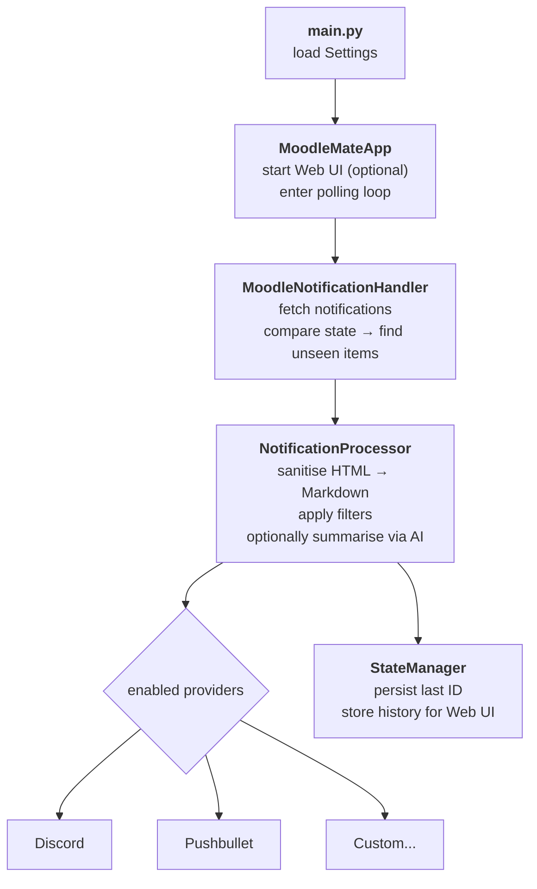

# Architecture overview

Moodle Mate is a **notification pipeline**: poll Moodle, transform and filter notifications,
optionally summarise with AI, then fan out to one or more delivery providers.

## Runtime flow



### Steps in detail

1. **`moodlemate.main`** loads `Settings` (from `.env` / environment) and assembles all components.
2. **`MoodleMateApp`** mounts the optional Web UI and enters the polling loop.
3. **`MoodleNotificationHandler`** calls the Moodle API and compares results against the persisted
   state to find notifications the app hasn't processed yet.
4. **`NotificationProcessor`** sanitises HTML payloads, converts them to Markdown, applies any
   configured filters (subject/course ID), and optionally calls the AI summariser.
5. Each active provider's `send()` method is called. Providers are invoked in parallel fan-out.
6. **`StateManager`** updates the last-seen notification ID on disk and maintains an in-memory
   history list for the Web UI's `/api/history` endpoint.

## Provider architecture

Providers are discovered dynamically by scanning:

```
moodlemate.providers.notification.<name>.provider
```

A provider is activated only when **all** conditions are met:

- A matching `<name>` field exists in `Settings`
- `<name>.enabled = true` in configuration
- The class subclasses `NotificationProvider`

Adding a new provider never requires changes to core dispatch logic.
See [Add a custom provider](../how-to/add-custom-provider.md).

## Reliability and control points

| Concern | Mechanism |
|---------|-----------|
| Polling interval | `MOODLEMATE_NOTIFICATION__FETCH_INTERVAL` (default 60 s) |
| HTTP retries | `RETRY_TOTAL` + `RETRY_BACKOFF_FACTOR` |
| Timeouts | `CONNECT_TIMEOUT` + `READ_TIMEOUT` |
| State persistence | Written on change; also forced on graceful shutdown |
| Session refresh | Moodle session is refreshed periodically in the polling loop |
| Health alerts | Routed to a specific named provider via `HEALTH__TARGET_PROVIDER` |

## Design intent

- **Separation of concerns** — Moodle API access, processing, delivery, and UI are decoupled layers.
- **Extensibility** — new providers are added without touching core dispatch code.
- **Operability** — defensive retry, persistent state, and health routing support long-running deployment.

## Related

- [Security model](security.md)
- [Configuration reference](../reference/configuration.md)
